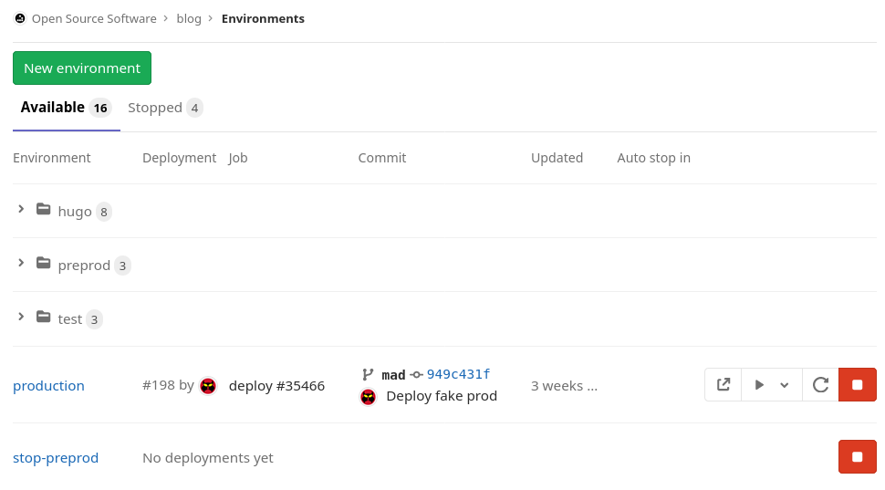
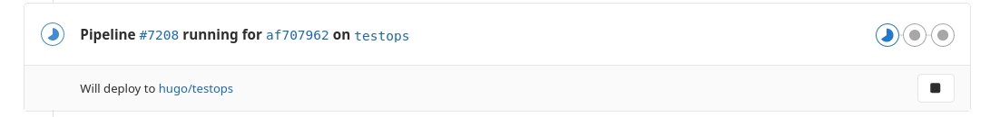
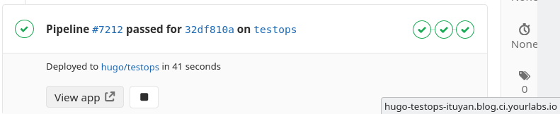
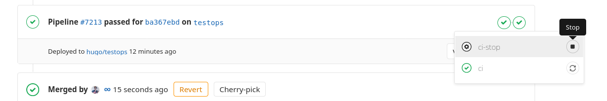
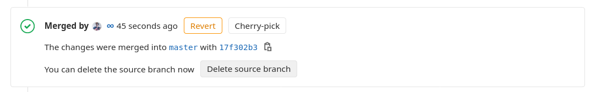
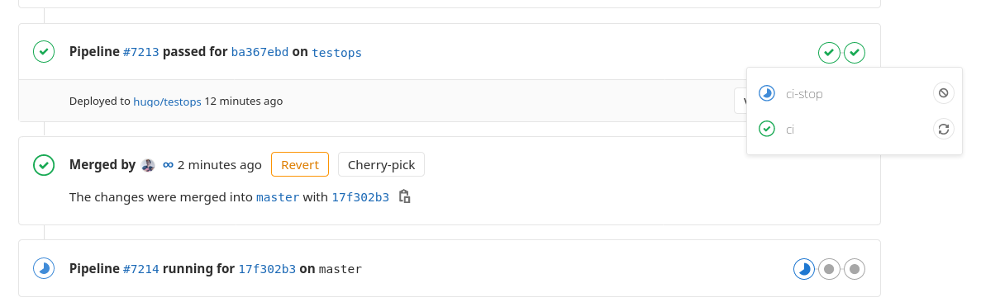

---?image=assets/img/hero.png

---

## Who

- 1995: first C program
- 2000: first "other human being giving a shit about my code"
- 2004: first programing job
- 2007: quit that job to go full Open Source in freelance
- 2008: award in Norway for an MVC academic paper
- 2010: join the Apache Software Foundation

---

- 2011: first indirect contribution to Django
- 2012: YourLabs Open Source software brand
- 2015: first commit in Django
- 2016: first commit in Ansible
- 2017: YourLabs Business Service and hackerspace
- 2018: 25k+ reputation on StackOverflow
- 2019: first commit in Python
- 2019: migrating from Nginx to Traefik
- 2020: first Traefik meetup :)

---

## Other content

- [Stabiliser SaltStack avec Ansible](https://www.infoq.com/fr/presentations/ansible-james-pic-etienne-bersac-stabiliser-saltstack-avec-ansible/)
- [Continuous Delivery & DevOps QuickStart](https://slides.com/jamespic/cd-devops)
- [Ansible Workshop](https://slides.com/jamespic/ansible-workshop)
- [GitLab-CI (r)Evolution](https://slides.com/jamespic/gitlab-ci-revolution)
- [300+ blog articles](https://blog.yourlabs.org)

---

## DevOps

Note:
- Dev and SysOps sharing a goal to deploy features

---

## Persistent deployment

Note:
- Deployment that sticks around over time

---

## eXtreme DevOps

Note:
- eXtreme DevOps is when code traditionnaly known as network and infrastructure operations automation meet continuous integration, merges with continuous delivery, made it almost trivial to deploy per-branch ephemeral deployments on each git push, say on test-$GIT_BRANCHNAME.ci.example.com, so that the product team can review a feature during development without forcing the developer to merge unfinished code into master, in order to keep the master branch clean and deployable at any moment.
- The goal of deploying patches before they are merged

---

## Ephemeral deployment

Note:
- Deployment that does not persist any data and is not meant to stick around

---

## Why not k8s

- 99.9% uptime plenty enough |
- No need for HA |

Note:
- On a practice where 99.9% uptime is plenty enough and as such no HA layer is introduced, although HA compatibility is not impossible to do with a bit of code: not the worries of our current userbase anyway.

---

## Why Traefik

- nginx-proxy: not failsafe
- caddy: Non-free

Note:
- nginx-proxy generates an nginx config by parsing the list of docker images
  if one of them contains a wrong value then the config will cause a syntax
  error and all the sites on this server are down
- non-free software not even considered

---

## Plan

- deploy ci (Continuous Integration) server |
- deploy production (Live Customers) server |
- ensure lifecycle |

Note:
The CI server is meant to be used by the team, and when reviewing with the product team. It should have one persistent production-like deployment called “staging”. “Staging” is not meant to be more stable than the CI server itself, so if the product / business team is going to show the software outside of production then that deployment should be persistent and happen on the production server.

---

## System architecture for reproductibility

Note:
The complete installation must be completely automated to keep both CI and
production servers as symmetric as possible, despite their usage will be
different: production needs more disk space, but development needs to be
faster.

---

## Partitionning

- /var/lib/docker |
- /home |
- / |
- swap |
- /backup |

Note:
- slide right
- the btrfs partition volume for Docker, might not be necessary, but this is ended becoming a regular automation so I would advise going through btrfs on /var/lib/docker
- /home: all human user (bob, alice) and project deployment (test, staging, production…) data. This should be the largest partition in our setup.
- /: well, we don’t need /boot because we’re booting the default Linux kernel which probably shows the default config in /proc anyway so we benefit from no protection if /boot is not mounted, most likely in this setup 20G is plenty enough, but 5 should also work after only docker runs in this setup and data accumulates only in /var/lib/docker and /home as described above
- swap: you want disk-time before you can’t SSH connect to your server anymore when memory becomes insufficient.
- /backup: in production, you would want your database to dump which involves a disk copy on a different raid array, especially if you have HDDs (production: for disk space rather than speed)
- Choose a server with sufficient size for 6 months of production, based on traffic estimates and the likes. You will need to be able to re-install a server in 30 minutes, after 30 minutes have a definitive ETA (file copy in progress from remote backup site ?).

---

## GitLab example: persistent deployment

```yaml
staging:
  environment:
    name: staging
    url: https://staging.ci.yourproject.com
  # your usual .gitlab-ci.yml code ...
```

@[1](Job name in the pipeline)
@[2](Configuration of the environment this job deploys)
@[3](Name of the environment)
@[4](Url of the environment)
@[5](Usual .gitlab-ci.yml configuration)

---

## GitLab job page


---

## GitLab environment list



---

## Review deployments

`yourbranch.ci.yourproject.com`

Note:
- Pushing to a new branch deploys a new ephemeral environment which does not
  persist after a reboot of the server
- Should self destruct at some point to not fill up the server
- Concept popularized by GitLab where branches would deploy in an
  ephemeral deployment with the branch name in the domain

---

## GitLab Example

```yaml
review-deploy:
  environment:
    name: test/$CI_COMMIT_REF_NAME
    url: http://${CI_ENVIRONMENT_SLUG}.ci.yourproject.com
    on_stop: review-stop
```

@[3](Name of the environment that contains the branch name)
@[4](URL of the environment that contains an URL-safe the branch name)
@[5](Name of the job that destroys the environment)

---

## Pipeline



Note:
- Pushing to testops branch and openning a merge request
- GitLab-CI knows it's going to deploy to an environment named hugo/testops

---

## Review deployment



---

## Deployment stop button



Note:
- The stop button may be useful to destroy and re-create a deployment
- typically when you change code of a migration script
- otherwise it's triggered by deleting the branch

---

## Deleting the branch



---

## Starts the on_stop job



---

## Ephemeral deployment lifetime

Note:
- branches are not always deleted by developers
- who never even think of destroying the environment
- that's why we need to start deployments with a lifetime


---

#### Example review-deploy

```yaml
review-deploy:
  stage: deploy
  image: yourlabs/ansible
  before_script:
  - mkdir -p ~/.ssh; echo "$ci_key" > ~/.ssh/id_ed25519; echo "$ci_fingerprint" > ~/.ssh/known_hosts; chmod 700 ~/.ssh; chmod 600 ~/.ssh/*
  environment:
    name: hugo/$CI_COMMIT_REF_NAME
    url: http://hugo:hugo_boss@$CI_ENVIRONMENT_SLUG.blog.ci.yourlabs.io
    on_stop: review-stop
  script:
  - bigsudo
    yourlabs.compose
    project=$CI_COMMIT_REF_NAME
    compose_hugo_image=$IMAGE_TAG
    lifetime=604800
    hugo@ci.yourlabs.io -v | tee deploy.log
  - grep unreachable=0 deploy.log &> /dev/null
  - grep failed=0 deploy.log &> /dev/null
```

@[1](Name of the job)
@[2](GitLab CI Pipeline stage name, defaults are build, test and deploy)
@[3](Image to run the deploy command in, we maintain our own)
@[4-5](Configure the SSH client from environment variables)
@[11](Bigsudo is an Ansible CLI wrapper)
@[12](yourlabs.compose is an Ansible role, usable without bigsudo)
@[13](Sets the -p argument for docker-compose instead of a persistent dir)
@[14](Name of the image that we just built)
@[15](Deploy with a lifetime of 7 days)
@[16](Ssh connection user@host)

---

#### Example review-stop

```yaml
review-stop:
  stage: deploy
  image: yourlabs/ansible
  when: manual
  environment:
    action: stop
    name: hugo/$CI_COMMIT_REF_NAME
  script:
  - mkdir -p ~/.ssh; echo "$ci_key" > ~/.ssh/id_ed25519; echo "$ci_fingerprint" > ~/.ssh/known_hosts; chmod 700 ~/.ssh; chmod 600 ~/.ssh/*
  - bigsudo
    yourlabs.compose
    down
    hugo@ci.yourlabs.io
    project=$CI_COMMIT_REF_NAME
    -v
```

@[10](Our ansible wrapper again)
@[11](Same ansible role)
@[12](Start the role's tasks/down.yml instead of the default tasks/main.yml)
@[13](Same target host)
@[14](Same project name)

---

# Sorry
## Server disk full

---

## Manual cleaning

- ensure ephemeral deployments go in a CI server |
- ensure their docker-compose.yml does not autorestart anything |
- ensure they don't bind a filesystem directory |
- reboot the server |
- run docker system prune -af --volumes |
- fine, but not particularely fun |

---

## Auto cleaning

- Keep a copy of each deployed compose in home |
- Compute removal date from lifetime and store it too |
- Make a simple cron script to delete old ephemeral stacks |
- yourlabs.compose Ansible role does that by default |

---

### Docker-compose stack

```
/home/lol $ docker-compose ...
```

Is equivalent to:

```
/anywhere $ docker-compose -p lol ...
```

---

## Ephemeral deployment information

- $HOME/.yourlabs.compose/$project_name |
- $HOME/.yourlabs.compose/$project_name/docker-compose.yml |
- $HOME/.yourlabs.compose/$project_name/removeat |

---

### Result tree

```
/home/deployuser/
  .yourlabs.compose/
    project_name/
      docker-compose.yml
      removeat
```

---

### Cron script

```sh
for home in /root /home/*; do
    [ -d $home/.yourlabs.compose ] || continue
    pushd $home/.yourlabs.compose &> /dev/null
    for project in *; do
        [ -f $project/removeat ] || continue
        if [[ $(date +%s) -gt $(<$project/removeat) ]]; then
            pushd $project
            docker-compose down --rmi all --volumes --remove-orphans
            popd &> /dev/null
            rm -rf $project
        fi
    done
    popd &> /dev/null
done
```

@[1](Find home directories)
@[2](Skip it if .yourlabs.compose dir not found)
@[3](Otherwise enter the directory)
@[4](Find each deployed stack)
@[5](If no removeat file present)
@[6](Compare current timestamp with removeat content)
@[7](If expired, enter the directory)
@[8](Destroy the compose stack)
@[9](Go back a directory)
@[10](Remove the project directory)

---

## Demo


